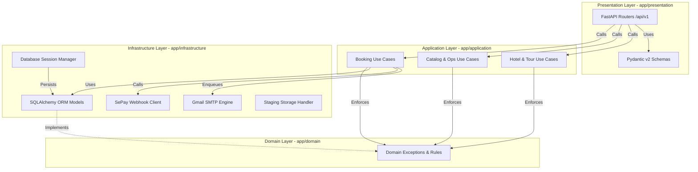
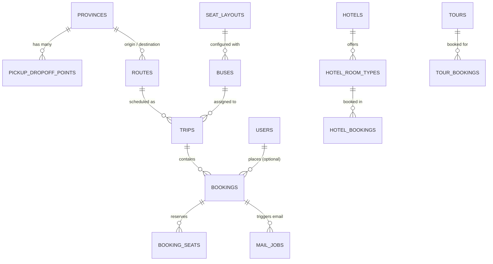
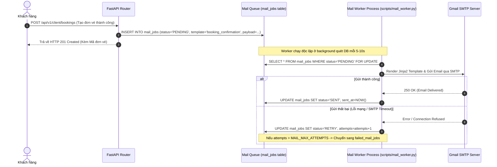

# System Architecture & Technical Flow

## 1. Clean Architecture Layer Dependency Diagram

Sơ đồ mô tả quy tắc phụ thuộc 1 chiều (Dependency Rule) giữa các tầng trong ứng dụng Backend:

---

## 2. Entity Relationship Diagram (Core Database Schema)

---

## 3. Asynchronous Mail Processing Architecture

Hệ thống hỗ trợ cơ chế gửi mail bất đồng bộ (Durable Mail Queue) ngăn ngừa nghẽn request:

---

## 4. SePay Payment Webhook Reconciliation

1. Khách hàng thực hiện chuyển khoản bằng mã QR VietQR chứa cú pháp `KINGEXPRESS <MÃ_VÉ>`.
2. SePay Gateway phát hiện giao dịch thành công trên biến động số dư ngân hàng.
3. SePay phát webhook `POST /api/v1/payments/sepay-webhook` tới Backend FastAPI.
4. Handler trích xuất nội dung giao dịch, tìm bản ghi `Booking` tương ứng theo `booking_code`.
5. Kiểm tra số tiền chuyển khớp với `total_amount` của đơn vé.
6. Cập nhật `payment_status = 'PAID'`, tự động enqueue mail xác nhận vé đã thanh toán vào `mail_jobs`.
